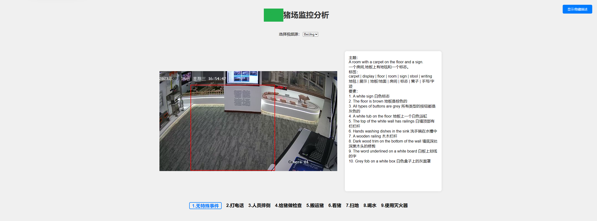

# Showroom Video Understanding

The Showroom Video Understanding project is a comprehensive, cutting-edge AI model for video understanding that integrates several individual state-of-the-art projects to deliver highly effective video analysis. This project is capable of identifying and understanding numerous objects and contexts within video content. 

This project comprises several independent projects including:

1. [Recognize Anything](https://github.com/xinyu1205/recognize-anything)
2. [GRiT](https://github.com/JialianW/GRiT)

## Model Zoo
This project utilizes several models. Download the necessary models and place them under the "model_zoo" directory. 

| Model | Link |
| --- | --- |
| RAM | [Download](https://huggingface.co/spaces/xinyu1205/Recognize_Anything-Tag2Text/blob/main/ram_swin_large_14m.pth) |
| tag2text | [Download](https://huggingface.co/spaces/xinyu1205/Recognize_Anything-Tag2Text/blob/main/tag2text_swin_14m.pth) |
| GRiT | [Download](https://datarelease.blob.core.windows.net/grit/models/grit_b_densecap.pth) |
| bert-base-uncased | [Download](https://huggingface.co/bert-base-uncased) |
| opus-mt-en-zh | [Download](https://huggingface.co/Helsinki-NLP/opus-mt-en-zh) |

## Installation

To setup the local environment, please refer to the Dockerfile.

## Run Project

Before running the project, ensure you have set your desired configurations in the `configs/configs.json` file. 

Here's a sample configuration:

```json
{
	"CUDA_VISIBLE_DEVICES": "0",
	"CAMERA_URIS": "demo=./demo.mp4",
	"PORT": "12005",
	"MAX_WORKERS": "1",
	"VALID_AREA": null
}
```

- `CUDA_VISIBLE_DEVICES` specifies the GPU number to be used. The default is 0.
- `CAMERA_URIS` represents a series of video files or video streams. It's in the form of "name=address", and different videos are separated by ",". Currently, there are bugs with multiple video sources, hence the recommendation to use a single video source.
- `PORT` specifies the port number the service will start on. The default is 12005.
- `MAX_WORKERS` represents the number of inference threads. The default is 1. Increasing this number will occupy more video memory.
- `VALID_AREA` is a string composed of a series of coordinates in the form of (x, y), indicating the effective area of inference. The default is to infer the whole image.

To start the project, you can either use local or docker methods:

Local:

```bash
python async_app.py
```

Docker:

```bash
docker build -f ./dockerfile -t showroom_video_understanding .
docker run --gpus=all -d --shm-size=64g  --ulimit memlock=-1 --rm -p12005:12005 -v /home/:/app/logs/ showroom_video_understanding
```

Happy video understanding!

<p "center">  </p>